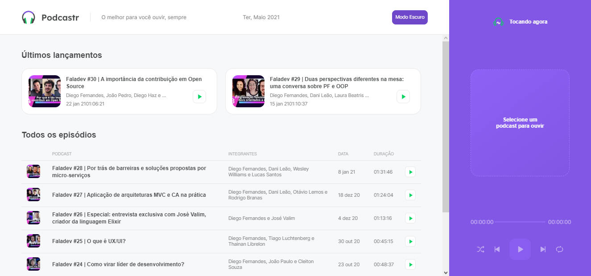
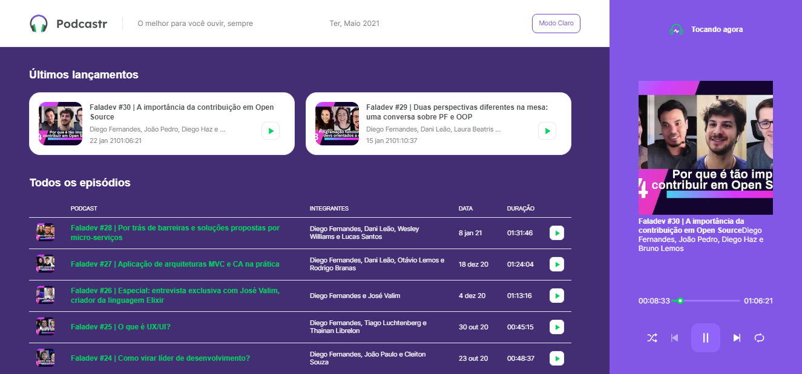
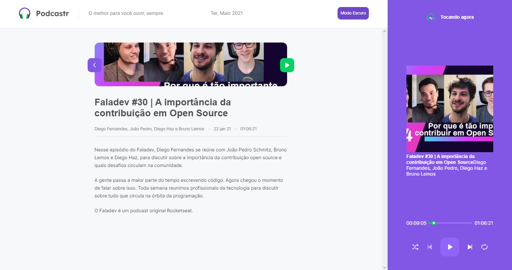
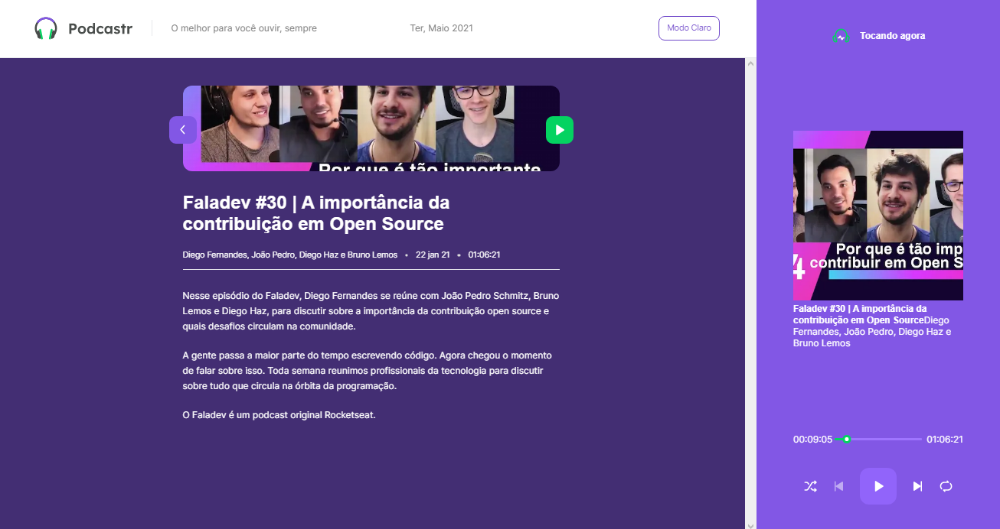

<div align="center">
  
</div>

## Descrição

Plataforma(site) com podcast desenvolvido durante o evento Next Level Week 5 promovido pela Rocketseat.  
A Plataforma disponibiliza episódios do podcast “FalaDev” onde é possível o internauta ouvir os episódios e obter uma descrição sobre o conteúdo de cada episódio.  

## Tecnologias

- ReactJs (https://reactjs.org/);
- NextJs (https://nextjs.org/);
- TypeScript (https://www.typescriptlang.org/);
- SASS (https://sass-lang.com)

## Stakeholders/Usuários

Desenvolvedores ou pessoas interessadas em tecnologia que seguem a Rocketseat.  

## Funcionalidades

### Recursos padrões

- Listagem das informações dos episódios obtidas por meio de uma API;
- Escutar determinado episódio.

**Observação**

O usuário pode tocar, pausar, avançar, retroceder, ativar modo aleatório para lista dos episódios disponíveis.

### Recursos Extras

Tema de visualização escuro.

## Telas

**Listagem com todos os episódios (Home)**

Modo Claro



Modo Escuro



**Página com detalhes sobre um episódio**

Modo Claro



Modo Escuro



## Requerimentos

* Servidor ou computador com Node 14 ou superior.

### Para execução em ambiente de desenvolvimento local

A) Faça o download deste repositório para máquina local

Exemplo:  

```bash
$ git clone https://github.com/fbnnd1/nlw5-podcastr-next.git && cd nlw5-podcastr
```

B) Instale todas as dependências do projeto

Exemplo:  

```bash
$ npm install 
```

C) No prompt de comando ou shell, execute os comandos:

Servidor backend com as informações sobre o Podcast

```bash
$ npm run server
```

Servidor da plataforma

```bash
$ npm run dev
```

## Agradecimentos

Segue o agradecimento a toda a comunidade de devs que participou do evento e membros da Rocketseat, em especial ao professor Diego Fernandes.

## Links externos

- Rocketseat (https://rocketseat.com.br)  
- Página do Spotify do FalaDev (https://open.spotify.com/show/3TNsKUGlP9YbV1pgy3ACrW)
